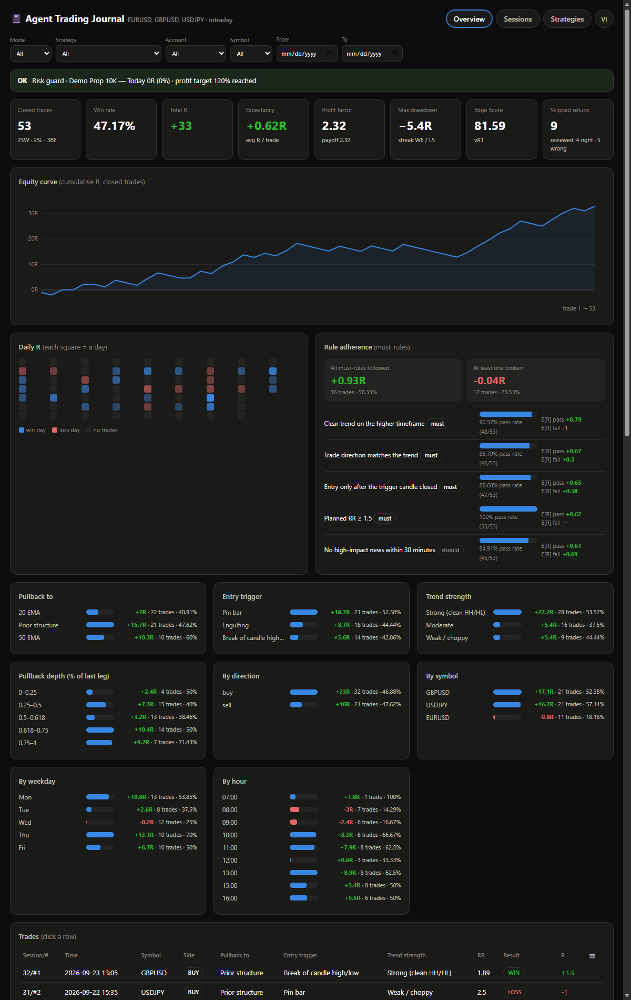

# Agent Trading Journal

**A trading journal your AI agent writes for you.** Paste a chart screenshot into Claude Code, Codex or any MCP client. The agent reads it, fills in *your* strategy's fields, checks the trade against *your* rules, logs it, and attaches the image. A local dashboard shows what's working.

No forms, no LLM API key, no account. Everything stays on your machine in one SQLite file.


<sub>Dashboard with generated demo data (`npx agent-trading-journal demo`). Not a real account.</sub>

## Why this exists

Most "AI trading journals" are a web form plus a chatbot that reads your numbers afterwards. Two problems follow:

1. **Logging is the bottleneck.** People stop journaling because entering trades by hand is tedious.
2. **Generic fields measure nothing specific.** "Setup: A/B/C" doesn't tell you whether *your* rules work.

Here the agent is the data-entry clerk, and the journal is shaped by an onboarding interview about how *you* trade:

| | Typical AI journal | Agent Trading Journal |
|---|---|---|
| Who enters trades | You, in a form | Your agent, from screenshots (or a broker statement) |
| How AI connects | The app calls an LLM with your API key | MCP: your agent (Claude Code / Codex / …) *is* the AI |
| What is measured | Fixed fields + free tags | Fields and a rule checklist defined for **your** strategy |
| Rules | Notes | Each rule is `pass/fail` per trade → "E[R] when followed vs broken" |
| Skipped setups | Not tracked | Logged and reviewed (was staying out right?) |
| Risk limits | Rarely | Prop-firm style guard: daily loss, max drawdown, trades/day, loss streak |

## Quick start

**1. Connect it to your agent.**

Claude Code:
```bash
claude mcp add journal -- npx -y agent-trading-journal
```

Codex CLI (`~/.codex/config.toml`):
```toml
[mcp_servers.journal]
command = "npx"
args = ["-y", "agent-trading-journal"]
```

Claude Desktop, Cursor, or any other MCP client: add a stdio server with command `npx` and args `["-y", "agent-trading-journal"]`. Run `npx agent-trading-journal setup` to print all the snippets.

**2. Tell your agent:** *"Set up my trading journal."*

It interviews you in your language: markets, risk rules, how you find bias, setups, entries, stops and targets, and when you don't trade. From your answers it proposes **fields** (what to measure on every trade) and **rules** (your entry checklist). You confirm, and it saves them. See [docs/ONBOARDING.md](docs/ONBOARDING.md) for the full script.

**3. Trade or backtest as usual.** Paste screenshots and say *"log this"*. Ask for *"weekly review"* or *"pre-session check"*. Say *"open the dashboard"* to see it at <http://localhost:3777>.

Just looking? `npx agent-trading-journal demo` fills a separate demo journal and opens the dashboard.

## What the agent can do (MCP tools)

| Area | Tools |
|---|---|
| Setup | `get_setup_status`, `get_onboarding_guide`, `set_profile`, `list_presets`, `import_preset`, `upsert_strategy`, `get_strategy`, `list_strategies`, `export_strategy` |
| Accounts & risk | `upsert_account`, `list_accounts`, `check_risk` |
| Journal | `start_session`, `list_sessions`, `log_trade`, `update_trade`, `delete_trade`, `query_trades`, `get_trade`, `add_screenshot` |
| Lessons | `add_lesson`, `update_lesson`, `delete_lesson`, `list_lessons` |
| Analysis | `get_stats`, `run_sql_readonly`, `export_review` (Markdown, Obsidian-friendly) |
| Import | `import_statement`: MetaTrader 4/5, TradingView, IBKR, ThinkorSwim, NinjaTrader, Tradovate, TopstepX, Webull, DAS, TradeZella, Tradervue, generic CSV |
| Dashboard | `start_dashboard`, `stop_dashboard`, `dashboard_status` |

MCP prompts (slash commands in clients that support them): `onboarding`, `log_trade_from_screenshot`, `weekly_review`, `pre_session_check`. The same workflows are available through the `get_workflow` tool for clients without prompt support.

## Concepts

- **Strategy**: your plan (bias, setup, entry, stop, targets, management, no-trade conditions), plus:
  - **Fields**: per-trade variables you want to analyse (`enum`, `bool`, `number`, `text`). Every non-text field gets its own breakdown chart.
  - **Rules**: your checklist, each `must` or `should`. Rule adherence compares expectancy when all must-rules were followed against when at least one was broken.
  - **Versions**: when fields or rules change, the version bumps. Old trades keep the version they were logged under, and removed fields are archived, not deleted.
- **Session**: a backtest, forward-test or live block on one symbol, optionally tied to an account.
- **R**: result in multiples of planned risk. Stats are R-based, so they compare across instruments and account sizes.
- **Presets**: [`presets/`](presets) has a *starter* template (for traders without a written strategy), a trend pullback and an opening-range breakout. They're starting points to edit, not recommendations.
- **Edge Score**: an open 0–100 composite ([docs/edge-score.md](docs/edge-score.md)), withheld under 5 trades.

## Data and configuration

| Env var | Default | Purpose |
|---|---|---|
| `JOURNAL_DATA_DIR` | `~/.agent-trading-journal` | folder with `journal.db` + `screenshots/` |
| `JOURNAL_DB`, `JOURNAL_SCREENSHOTS` | inside the data dir | override either path |
| `JOURNAL_PORT` | `3777` | dashboard port (binds to `127.0.0.1` only) |
| `JOURNAL_WEB` | unset | `1` = start the dashboard together with the MCP server |

Back up by copying the data dir. `run_sql_readonly` and the SQLite file are yours to query.

## CLI

```text
agent-trading-journal [mcp]            MCP server on stdio (what MCP clients run)
agent-trading-journal dashboard        dashboard at http://localhost:3777
agent-trading-journal demo             demo data in a separate dir + dashboard
agent-trading-journal import <file> --account <name> [--strategy <slug>] [--dry-run]
agent-trading-journal setup            config snippets for Claude Code / Claude Desktop / Codex
```

## Safety

This is a journaling and analysis tool. It does not place trades, connect to brokers for execution, or give financial advice. Leveraged trading is high-risk. The agent's chart reading can be wrong: every logged value is visible and editable, and rule checks show which ones failed and why.

## Credits and license

MIT © 2026 [smizxe](https://github.com/smizxe).

Statement parsing and round-trip reconstruction use [`@luxalgo/journal-importers`](https://www.npmjs.com/package/@luxalgo/journal-importers) and [`@luxalgo/journal-core`](https://www.npmjs.com/package/@luxalgo/journal-core) (MIT) from [LuxAlgo's Trade Journal](https://github.com/LuxAlgo/trade-journal). The Edge Score is adapted from their open formula. This project is not affiliated with or endorsed by LuxAlgo.
